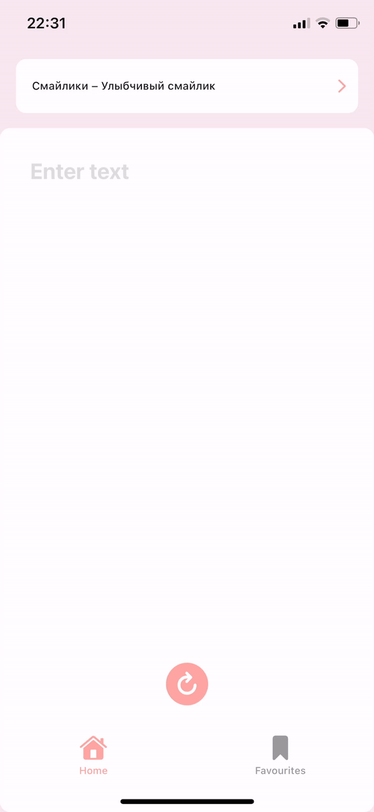
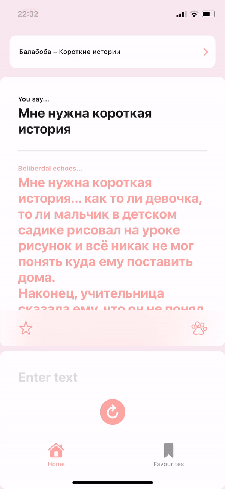
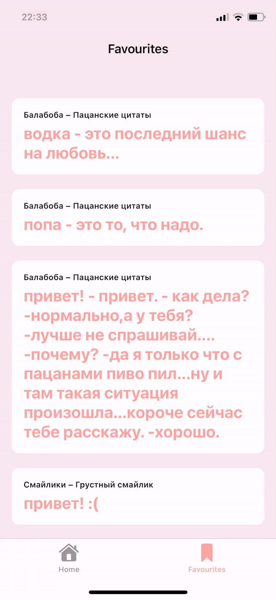

# Белибердал
## Что это?
Это – итоговый проект для iOS школы Сбербанка. Задумывался как обертка над Балабобой Яндекса, в процессе дополнялся на ходу.
## Как запустить?
1. Откройте корень проекта в терминале
2. Введите в консоль
```
pod install
```
3. Откройте файл .xcworkspace
## Как оно работает?
Хотел поработать с комбайном – поработал..) Архитектура модулей построена на MVVM на двусторонних биндингах, так же был применен зародыш координатора (только чтобы прокидывать зависимости в контроллеры).
### Экраны
1. Главный экран
    – представляет собой копию стандартного айосного переводчика. Для взаимодействия нужно ввести строку в текстовое поле и нажать кнопку по центру экрана или на контекстную кнопку клавиатуры. После получения результата всплывашка уедет и покажется вьюшка с контентом. На ней две кнопки – добавить в избранное (звездочка) и открыть картинку с котиком, который говорит изначально переданную строчку (лапка). Чтобы выбрать режим – нажмите на кнопку в самом верху.
    
<a> </a><a> </a>

2. Экран с настройками
    – представляет собой список доступных опций трансформеров. 
    
<a> </a>

3. Экран с котиками
    – просто котики :) Базовая реализация пункта с загрузкой медиа из сети из списка требований по проекту.
    
<a> </a>

4. Экран с избранными
    – табличка с результатами, добавленными в избранное. Поддерживает swipe to delete, работает с кордатой через простенькую обертку на DTO.
    
<a> </a>

### Известные проблемы
1. Главный экран

    1.1 На нажатие кнопок с пустым полем ввода не будет никакой реакции
    
    1.2 Не хватает интерактивности со всплывашкой (докинуть drag gesture)
    
    1.3 Вьюшка получилась очень громоздкой и неудобной в чтении/изменении, т.к. содержит в себе много логики по стейтам и анимациям.
    
    1.4 Слабая обработка ошибок (почти никакая)
    
    1.5 Нет анимаций/алертов на добавление результата в избранное
    
2. Экран с настройками

    2.1 У самого экрана как такового проблем нет, зато есть конкретная привязка к инаму, определяющему список трансформеров, на всех уровнях взаимодействия с настройками – сильно затрагивает юнит тесты. Как сделать лучше – не придумал, как стану большим и взрослым разработчиком – обязательно придумаю.


#### License
MIT, of course ;)
